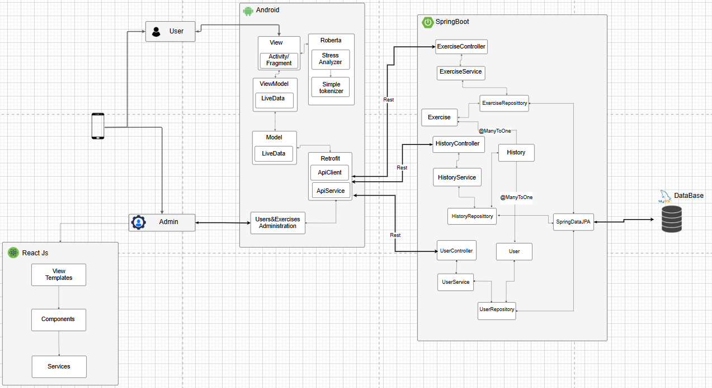

# Mindful Moments: Stress Management Application Based on Mindfulness


[Description courte de votre projet]

## Table of Contents
- [Software architecture](#Software-architecture)
- [Docker Image](#Docker-Image)
- [Frontend](#frontend)
- [Backend](#backend)
- [Getting Started](#getting-started)
- [Video Demonstration](#Video-Demonstration)
- [Contributing](#contributing)


## Software Architecture

The application follows a modern three-tier architecture:
- **Frontend**: Built with React.js, featuring a component-based structure with view templates and dedicated services
- **Mobile**: Android application implementing MVVM (Model-View-ViewModel) pattern with LiveData for reactive updates and integrated Roberta AI model for real-time stress analysis and text sentiment detection
- **Backend**: Spring Boot-based REST API with a layered architecture:
 - Controllers for handling HTTP requests
 - Services for business logic
 - Repositories for data access using Spring Data JPA
 - MySQL database for data persistence

The system implements a clean separation of concerns where each layer communicates through well-defined interfaces, ensuring modularity and maintainability. The mobile application includes an AI-powered stress detection feature using the Roberta model along with a simple tokenizer for text processing.

## Docker Image
```yaml
version: '3.8'
services:
  mysql:
    image: mysql:8.0
    container_name: mysql
    environment:
      MYSQL_DATABASE: stress3
      MYSQL_ROOT_PASSWORD: root
    ports:
      - "3307:3306"
    volumes:
      - mysql_data:/var/lib/mysql
    networks:
      - app-network
    healthcheck:
      test: ["CMD", "mysqladmin", "ping", "-h", "localhost"]
      interval: 10s
      timeout: 5s
      retries: 3
  backend:
    build:
      context: .
      dockerfile: backend/Dockerfile
    container_name: backend
    environment:
      - SPRING_DATASOURCE_URL=jdbc:mysql://mysql:3306/stress3?useSSL=false&allowPublicKeyRetrieval=true&serverTimezone=UTC
      - SPRING_DATASOURCE_USERNAME=root
      - SPRING_DATASOURCE_PASSWORD=root
      - SERVER_PORT=8080
    volumes:
      - ./uploads:/app/uploads
    depends_on:
      mysql:
        condition: service_healthy
    networks:
      - app-network
  frontend:
    build:
      context: .
      dockerfile: frontend/Dockerfile
    container_name: frontend
    environment:
      - NODE_ENV=production
    ports:
      - "80:80"
    depends_on:
      - backend
    networks:
      - app-network
networks:
  app-network:
    driver: bridge
volumes:
  mysql_data:
```
## Frontend
### Technologies Used from mobile side 

Android 
Java

### Technologies Used from web side 

React Js 
Css

## Backend
### Technologies Used

Spring Boot 
MySql

## Project Structure
Our project follows a comprehensive three-tier architecture split into backend (Spring Boot), frontend (React.js), and mobile (Android) applications.

### Backend Structure (Spring Boot)
The backend code follows a modular and organized structure, leveraging Spring Boot for building a robust and scalable application.

1. **com.example.demo**
  - *Main Application Class:* DemoApplication.java serves as the entry point
  - *Configuration:* WebConfig.java for application configuration
  - *Controllers:* VideoController.java for handling video-related endpoints

2. **Package Organization:**
  - *controller:* Handles HTTP requests and API endpoints
  - *exceptions:* Custom exception handling
  - *model:* Data entities and database mappings
  - *repository:* JPA repositories for database operations
  - *service:* Business logic implementation

### Frontend Structure (React.js)
The React application follows a modern component-based architecture:

1. **src Directory:**
  - *components:* Reusable UI components
  - *hooks:* Custom React hooks
  - *pages:* Main application views
  - *services:* API integration services
  - *App.jsx:* Main application component
  - *index.jsx:* Application entry point

### Mobile Structure (Android Java)
The Android application follows the MVVM pattern:

1. **com.example.myapplication:**
  - *adapter:* Custom adapters for RecyclerViews
  - *api:* API integration interfaces
  - *model:* Data models
  - *utils:* Utility classes
  - *viewmodels:*
    - ExerciseViewModel.java
    - HistoryViewModel.java
  - *Activities:* 
    - FirstActivity.java (Entry point)
    - AdminHomeActivity.java (Admin dashboard)
    - HomeActivity (User Home)
    - SpotifyMusicActivity
    - EditExerciseActivity
    - AddExerciseActivity
  - *Fragments:*
    - ExerciseFragment.java
    - HistoryFragment.java
    - AboutUsFragment.java
    - RecommandationFragment.java
    - AcceuilFragment.java
    - AcceuilAdminFragment.java
    - UserManagmentFragment.java
    - AdminExerciseFragment.java
    - ExerciseDetailsBottomSheet.java
 - *Roberta:*
   - StressAnalyzer.java
   - SimpleTokenizer.java

### Dependencies

1. **Backend Dependencies:**
```xml
<!-- Spring Boot Starter Web -->
		<dependency>
			<groupId>org.springframework.boot</groupId>
			<artifactId>spring-boot-starter-web</artifactId>
		</dependency>
		<!-- Spring Boot Starter Data JPA -->
		<dependency>
			<groupId>org.springframework.boot</groupId>
			<artifactId>spring-boot-starter-data-jpa</artifactId>
		</dependency>
		<!-- MySQL Connector -->
		<dependency>
			<groupId>com.mysql</groupId>
			<artifactId>mysql-connector-j</artifactId>
			<version>${mysql-connector.version}</version>
			<scope>runtime</scope>
		</dependency>
		<!-- Spring Boot Starter Test -->
		<dependency>
			<groupId>org.springframework.boot</groupId>
			<artifactId>spring-boot-starter-test</artifactId>
			<scope>test</scope>
		</dependency>
		<!-- XMLUnit Core (mise à jour) -->
		<dependency>
			<groupId>org.xmlunit</groupId>
			<artifactId>xmlunit-core</artifactId>
			<version>2.9.1</version>
		</dependency>
```
2. **React js Dependencies:**
```
{
  "name": "minfulmoments",
  "version": "0.1.0",
  "private": true,
  "proxy": "http://localhost:8088",
  "dependencies": {
    "@headlessui/react": "^2.2.0",
    "cra-template-typescript": "1.2.0",
    "lucide-react": "^0.469.0",
    "react": "^18.3.1",
    "react-dom": "^18.3.1",
    "react-router-dom": "^7.1.1",
    "react-scripts": "5.0.1",
    "web-vitals": "^4.2.4"
  },
  "scripts": {
    "start": "react-scripts start",
    "build": "react-scripts build",
    "test": "react-scripts test",
    "eject": "react-scripts eject"
  },
  "eslintConfig": {
    "extends": [
      "react-app",
      "react-app/jest"
    ]
  },
  "browserslist": {
    "production": [
      ">0.2%",
      "not dead",
      "not op_mini all"
    ],
    "development": [
      "last 1 chrome version",
      "last 1 firefox version",
      "last 1 safari version"
    ]
  },
  "devDependencies": {
    "@types/react-router-dom": "^5.3.3",
    "autoprefixer": "^10.4.20",
    "postcss": "^8.4.49",
    "tailwindcss": "^3.4.17",
    "typescript": "^4.9.5",
    "@babel/plugin-proposal-private-property-in-object": "^7.21.11"

  }
  
}

```

3. **Mobile Dependencies:**
```
dependencies {
    implementation 'androidx.appcompat:appcompat:1.6.1'
    implementation 'com.google.android.material:material:1.10.0'
    implementation 'androidx.constraintlayout:constraintlayout:2.1.4'
    // Lottie Animation
    implementation 'com.airbnb.android:lottie:6.1.0'
    // Retrofit pour les appels réseau
    implementation 'com.squareup.retrofit2:retrofit:2.9.0'
    implementation 'com.squareup.retrofit2:converter-gson:2.9.0'
    implementation 'com.google.code.gson:gson:2.10.1'
    // OkHttp pour les logs
    implementation 'com.squareup.okhttp3:logging-interceptor:4.9.3'
    // Glide pour le chargement d'images
    implementation 'com.github.bumptech.glide:glide:4.15.1'
    implementation libs.activity
    annotationProcessor 'com.github.bumptech.glide:compiler:4.15.1'
    // AndroidX components
    implementation 'androidx.swiperefreshlayout:swiperefreshlayout:1.1.0'
    implementation 'androidx.lifecycle:lifecycle-viewmodel:2.6.2'
    implementation 'androidx.lifecycle:lifecycle-livedata:2.6.2'
    implementation 'androidx.webkit:webkit:1.7.0'
    implementation 'androidx.viewpager2:viewpager2:1.0.0'
    // Google Play Services
    implementation 'com.google.android.gms:play-services-maps:18.1.0'
    implementation 'com.google.android.gms:play-services-location:21.0.1'
    // Charts
    implementation 'com.github.PhilJay:MPAndroidChart:v3.1.0'
    // EventBus pour la communication entre composants
    implementation 'org.greenrobot:eventbus:3.2.0'
    // Testing
    testImplementation 'junit:junit:4.13.2'
    androidTestImplementation 'androidx.test.ext:junit:1.1.5'
    androidTestImplementation 'androidx.test.espresso:espresso-core:3.5.1'
    implementation 'org.pytorch:pytorch_android:1.10.0'
    implementation 'org.pytorch:pytorch_android_torchvision:1.10.0'
}
```
## Getting Started

### Prerequisites:

1. **Development Environment:**
  - Java JDK 17 or higher
  - Node.js (v14.11.0)
  - Android Studio
  - Maven 3.x
  - Git

2. **Database:**
  - MySQL Server 5.7 or higher
  - Configure MySQL to run on port 3306

3. **IDE Recommendations:**
  - IntelliJ IDEA for backend development
  - Visual Studio Code for React development
  - Android Studio for mobile development

### Backend Setup:
1. **Clone the repository:**
  ```bash
  git clone [your-repository-url]
  cd backend
```
2. **Configure Database:**
```
properties
# Update application.properties
spring.datasource.url=jdbc:mysql://localhost:3306/your_db_name
spring.datasource.username=your_username
spring.datasource.password=your_password
```
3. **Run the application:**
```bash
mvn clean install
mvn spring-boot:run
```
Backend will be running on http://localhost:8080
### Frontend Setup:

1. **Install dependencies:**
```bash
cd frontend
npm install
```
2. **Start the development server:**
```bash
npm start
```
Frontend will be accessible on http://localhost:3000

### Mobile Setup:

1. **Open Android Studio:**

Open the /android folder as a project
Let Gradle sync complete


2. **Configure API endpoint:**
```java
// Update BASE_URL in ApiClient.java
public static final String BASE_URL = "http://your-backend-url:8080/";
```
3. **Run the application:**

Select your target device/emulator
Click "Run" in Android Studio


### Verification

Backend APIs: http://localhost:8080/api/test
Frontend Admin: http://localhost:3000
Database: Check MySQL connection on port 3306

For any issues during setup, please check logs in:

Backend: logs/spring-boot-logger.log
Frontend: Browser console
Mobile: Android Studio Logcat


## Video Demonstration
[Insérez votre vidéo ou lien vers la vidéo]
Utilisation
Authentification :

[Type d'utilisateur 1]

Email : [email]
Mot de passe : [mot de passe]


[Type d'utilisateur 2]

Email : [email]
Mot de passe : [mot de passe]


Contributing
[Message d'invitation aux contributions]
Contributors

[Nom Contributeur 1] ([Lien profil])
[Nom Contributeur 2] ([Lien profil])

